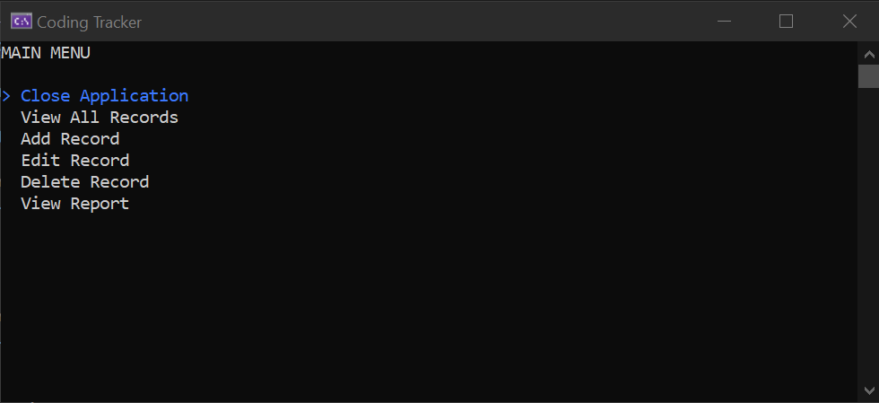

# Coding Tracker

The [Coding Tracker](https://www.thecsharpacademy.com/project/13/coding-tracker) project is focused on implementing Object Oriented Programming. It uses a SQLite database to store coding sessions and Spectre.Console for formatting output. I used the Model-View-Controller pattern to organize my classes. This project is part of the curriculum from [The C# Academy](https://www.thecsharpacademy.com/).

## Requirements

- [x] This application has the same requirements as [Habit Logger](https://thecsharpacademy.com/project/12/habit-logger), except that now you'll be logging your daily coding time.
- [x] To show the data on the console, you should use the "Spectre.Console" library.
- [x] You're required to have separate classes in different files (ex. UserInput.cs, Validation.cs, CodingController.cs)
- [x] You should tell the user the specific format you want the date and time to be logged and not allow any other format.
- [x] You'll need to create a configuration file that you'll contain your database path and connection strings.
- [x] You'll need to create a "CodingSession" class in a separate file. It will contain the properties of your coding session: Id, StartTime, EndTime, Duration
- [x] The user shouldn't input the duration of the session. It should be calculated based on the Start and End times, in a separate "CalculateDuration" method.
- [x] The user should be able to input the start and end times manually.
- [x] You need to use Dapper ORM for the data access instead of ADO.NET. (This requirement was included in Feb/2024)
- [x] When reading from the database, you can't use an anonymous object, you have to read your table into a List of Coding Sessions.
- [x] Follow the DRY Principle, and avoid code repetition.

